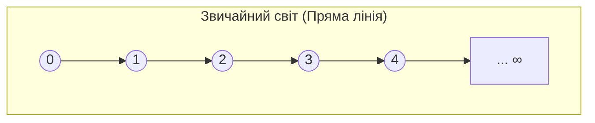
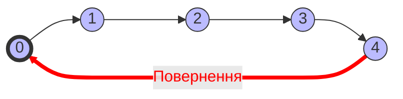
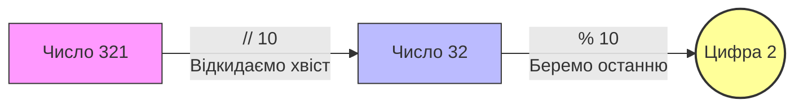

---
{"dg-publish":true,"permalink":"/01-lekcziyi/sintaksis/modulna-arifmetika/","noteIcon":""}
---


> [!abstract] План заняття
> 1. Що таке модульна арифметика
> 2. Застосування модульної арифметики
> 3. Задачі на знаходження цифр
> 4. Задачі на рух по колу
> 5. Задачі на годинник
> 6. Циклічність остачі. Загальний алгоритм спрощення задачі до роботи з остачею

## Що таке модульна арифметика

В класичному представлені числа мають вигляд впорядкованої числової прямої і виконуючи операції з числами ми переміщуємось по цій прямій.



Якщо ж ми говоримо про представлення чисел за допомогою остачі то ми отримуємо послідовність чисел які ідуть по колу. Наприклад, якщо ми шукаємо остачу ділення якогось числа на 5 то ми можемо отримати числа: 0, 1, 2, 3, 4. 

Якщо при діленні числа на 5 отримали остачу 4, то наступне число при діленні на 5 дасть остачу 0(поділиться націло).



Таким чином ми можемо представляти числа у вигляді остач від ділення на якесь число, а за рахунок циклічності такого представлення ми можемо працювати з дуже великими числами завдяки спрощенню їх представлення.

## Застосування модульної арифметики

### Ознаки подільності

> [!attention] Ознаки подільності
> Для того щоб перевірити чи ділиться число `a` націло на число `b`, достатньо перевірити чи отримаємо ми `0` при знаходженні остачі від ділення (`a % b`)

Таким чином нам не потрібно розписувати кодом ознаки подільності за правилами математики, що економить нам як час на написання коду так і ресурси комп'ютера в процесі виконання алгоритму.
### Криптографія та безпека

Повідомлення в месенджерах, банківські транзакції та паролі захищені алгоритмами (наприклад, RSA), які базуються на дуже складних обчисленнях остач від ділення велетенських чисел.

А також модульна арифметика застосовується для таких задач:

- **Хеш-таблиці:** Швидкий розподіл даних у пам'яті комп'ютера.
- **Контрольні суми:** Перевірка правильності введення номера картки, штрих-коду або ISBN книги (алгоритм Луна).
- **Генератори випадкових чисел:** Створення "рандому" в іграх.
- **Календарі:** Розрахунок дня тижня для будь-якої дати в майбутньому (цикл 7 днів).

І це лише малий приклад її застосування.

## Знаходження цифр числа

Є ряд класичних олімпіадних задач з програмування: Задачі на знаходження цифр.
Розглянемо число `27`: в ньому `2` десятки та `7` одиниць. 

Ми користуємось десятковою системою числення і для розбиття числа на цифри дуже зручно користуватись діленням  `//` та `%` на 10, 100, 1000 і т.д.

> [!attention] Потрібно запам'ятати
> - Цілочисельне ділення `//` використовується для знаходження старших розрядів та відкидання зайвих цифр
> - Остача від ділення для знаходження потрібної цифри або меншого розряду

Код для розбивання числа `27` на цифри за допомогою ділення виглядатиме ось так

```python
num: int = 27
num1: int = 27 // 10 #виведе число 2
num2: int = 27 % 10 #виведе число 7
print(num1, num2)
```

> [!faq] Уточнення
> Для того щоб у функції `print()` вивести значення декількох змінних, їх потрібно вказати через кому. Прийнято після коми завжди ставити пробіл.

Для трицифрового числа алгоритм виглядатиме наступним чином:

```python
num: int = 321
num1: int = 321 % 10 #виведе останню цифру
num2: int = (321 // 10) % 10 #виведе середню цифру
num3: int = 321 // 100 #виведе першу цифру

print(num3, num2, num1)
```

> [!light-yellow] Пояснення
> Для того щоб вивести середню цифру спочатку відкинули останню шляхом цілочисельного ділення на 10 щоб залишилось лише перших дві цифри. А потім за допомогою ділення з остачею на 10 знаходимо потрібне значення.
> 

У вигляді діаграми це виглядає ось так:



Розглядаючи алгоритм на більшу кількість цифр виводиться загальний алгоритм пошуку цифри в числі:

> [!formula] Формула цифри в числі
> (num // 10 ** (n - i)) % 10

> [!light-yellow] Пояснення
> `n` — загальна кількість цифр у числі.
> `i` — номер цифри, яку шукаємо (рахуємо **зліва направо**, починаючи з 1).
> 
> Ми ділимо число на $10$ у степені, який "прибирає" всі зайві цифри справа до потрібної нам позиції. А потім операцією `% 10` забираємо саму цифру.

*Іншими словами:* 

Оскільки ми виділяємо цифру через ділення на 10, то для знаходження конкретної цифри нам потрібно відкинути всі цифри після неї за допомогою цілочисельного ділення
на 10 в степені (n - i) .
Де `n` це кількість цифр в числі, а `i` це номер цифри яку нам потрібно знайти. 
Потім ми знаходимо остачу від ділення на 10 отриманого числа, що і буде шуканою цифрою.

